# 🩸 Blood Donation App

A modern **Blood Donation iOS App** built using **SwiftUI**, focused on connecting donors and recipients quickly and efficiently.  
The app allows users to **find donors**, **register as a donor**, and **request blood** based on location and blood group.

---

## 📱 Features

- 🔍 **Search Donors**
  - Find nearby donors based on blood group
  - View donor details like age, address, donation history, and availability

- 🩸 **Donate Blood**
  - Easy donor registration form
  - Collects essential information securely
  - Users are notified once the donation date is scheduled

- 📢 **Campaigns**
  - Invite friends and colleagues to blood donation campaigns
  - Simple opt-in interaction per campaign

- 🧾 **Clean UI & UX**
  - Built entirely with SwiftUI
  - Reusable components
  - Smooth sheet transitions and animations
  - Custom typography (Ubuntu font)

---

## 🛠 Tech Stack

- **Language:** Swift  
- **Framework:** SwiftUI  
- **Architecture:** MVVM (Lightweight)  
- **iOS Version:** iOS 15+  
- **UI Components:**  
  - Custom TextFields  
  - Bottom Tab Bar  
  - Sheets with custom heights  
  - AttributedString for rich text styling  

---

## 📸 Screenshots

<table>
  <tr>
      <td align="center">
      <strong>SplashScreen 1</strong> 
      
    </td>
      <td align="center">
      <strong>Splash Screen 2</strong> 
      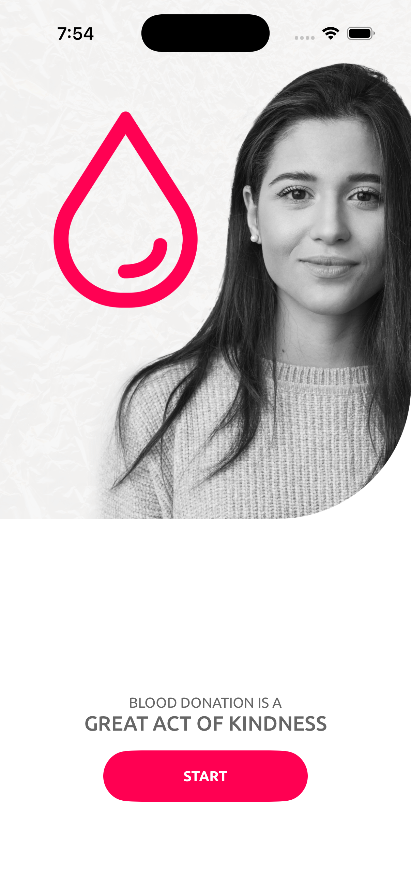
    </td>
    <td align="center">
      <strong>Home Page</strong> 
      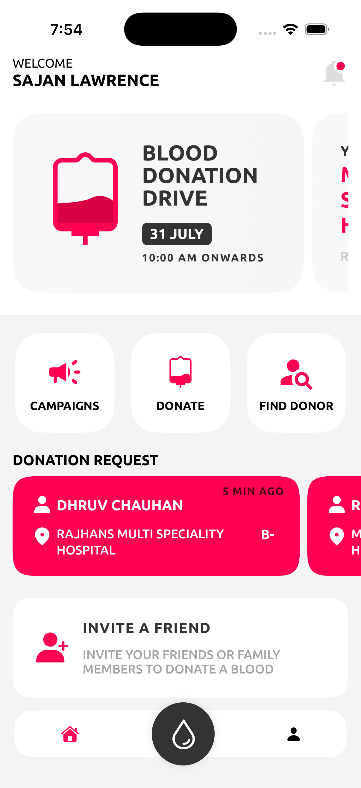
    </td>
        <td align="center">
      <strong>Notifications Page</strong> 
      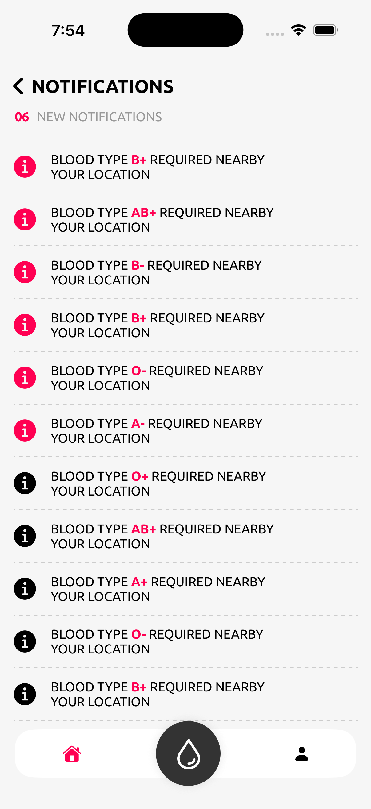
    </td>
  </tr>
  <tr>
    <td align="center">
      <strong>Campaigns Page</strong> 
      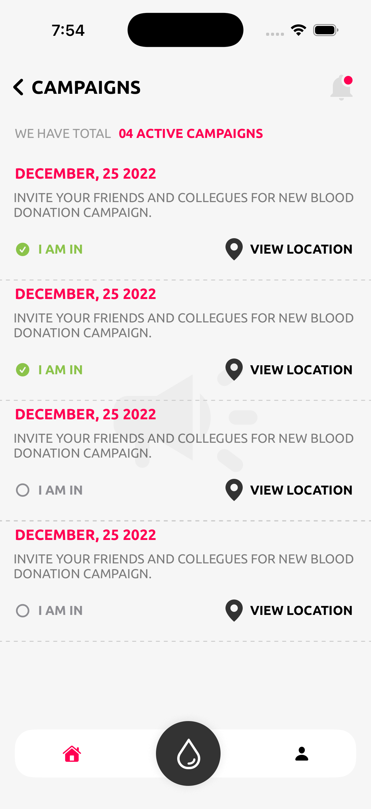
    </td>
    <td align="center">
      <strong>Profile Page</strong> 
      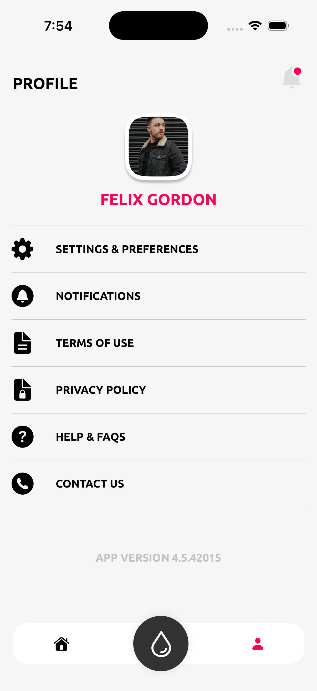
    </td>
        <td align="center">
      <strong>Personal Details Form</strong> 
      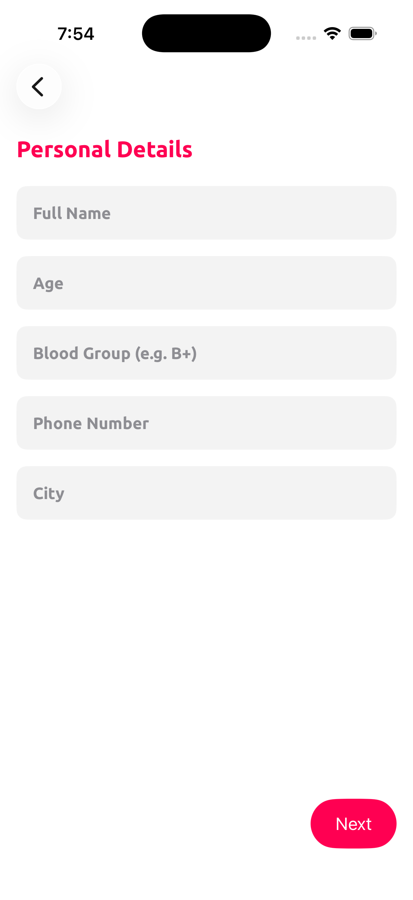
    </td>
            <td align="center">
      <strong>Health Details Form</strong> 
      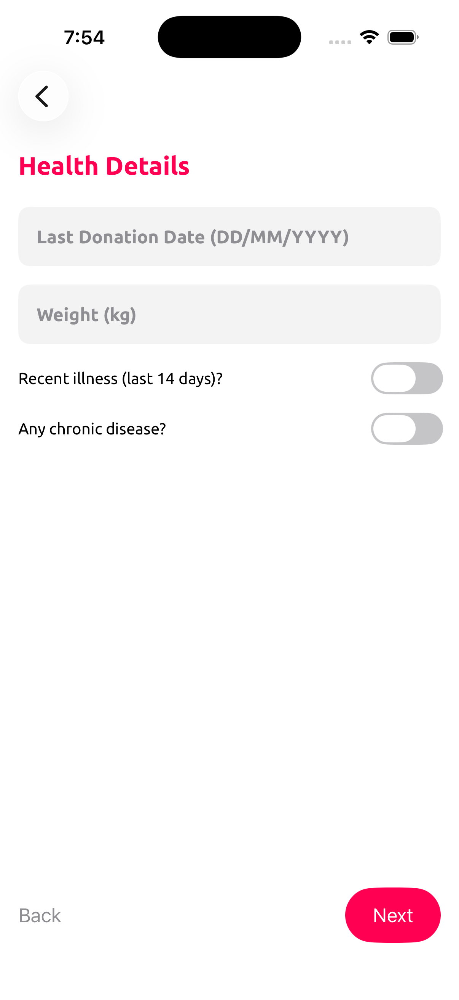
    </td>
  </tr>
    <tr>
    <td align="center">
      <strong>Consent Form</strong> 
      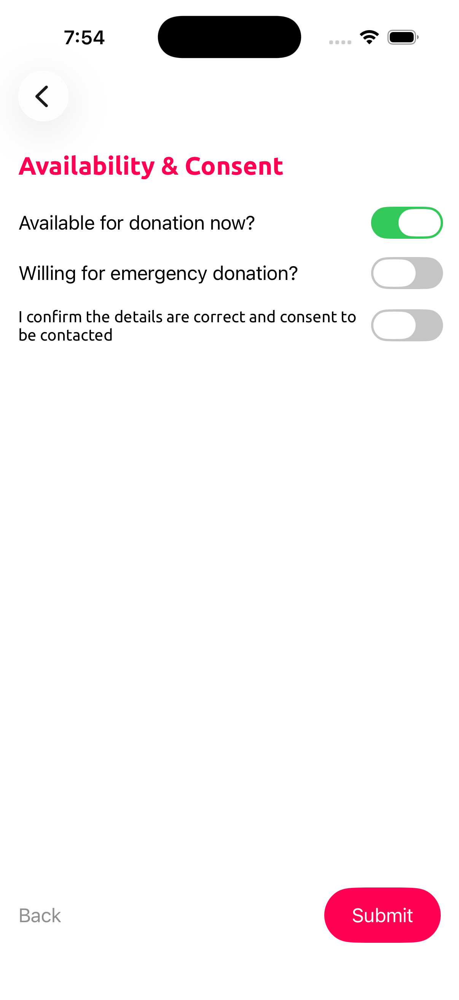
    </td>
    <td align="center">
      <strong>Thanks Screen</strong> 
      
    </td>
        <td align="center">
      <strong>BloodGrpSelection Page</strong> 
      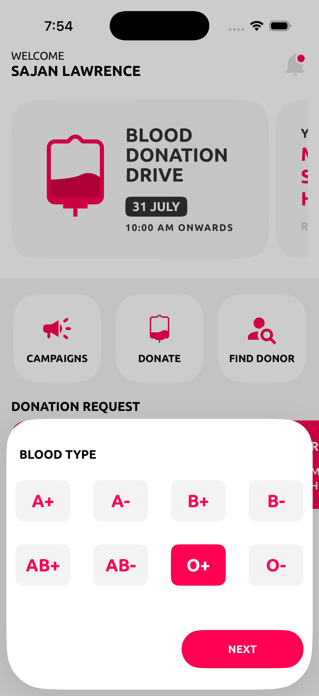
    </td>
            <td align="center">
      <strong>Location Selection</strong> 
      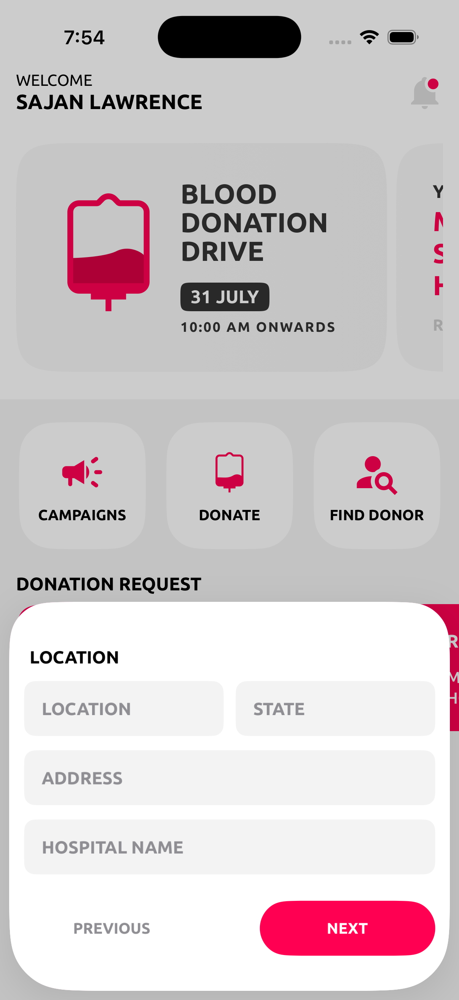
    </td>
  </tr>
    <tr>
      <td align="center">
      <strong>Requirement Page</strong> 
      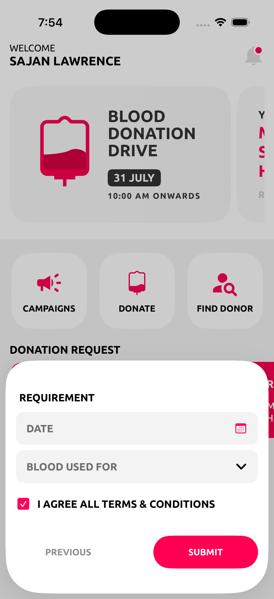
    </td>
    <td align="center">
      <strong>SearchResult Page</strong> 
      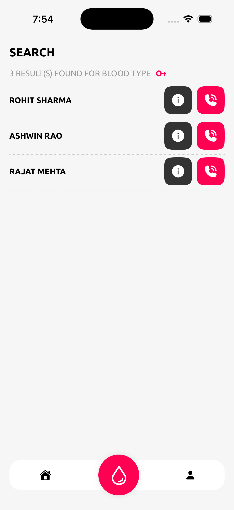
    </td>
        <td align="center">
      <strong>DonorProfile Page</strong> 
      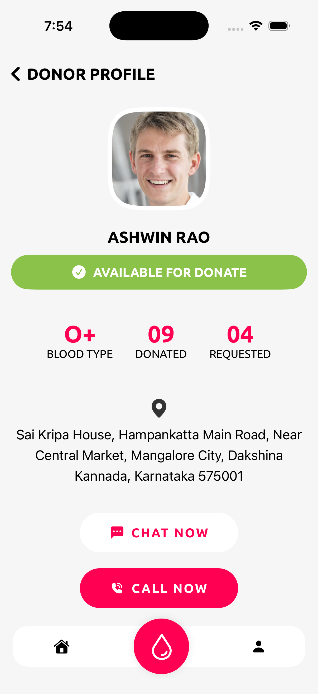
    </td>
  </tr>
</table>

---

---

📋 Future Enhancements

- 🔐 Authentication (Login / Signup)
- 🌐 Backend integration (Firebase / REST API)
- 📍 Live map view with donor pins
- 🔔 Push notifications for urgent blood requests
- 🧑‍⚕️ Blood bank & hospital integration

🎨 Design Credits

The UI/UX design for this app is inspired by Dhruv Chauhan.
Designer: Dhruv Chauhan
Figma Community Profile:
👉 https://www.figma.com/files/team/909150106491884711/resources/community/@dhruvchauhan

All design credits belong to the original designer.
This project is built purely for learning and portfolio purposes.
